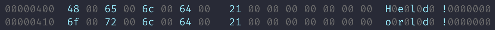
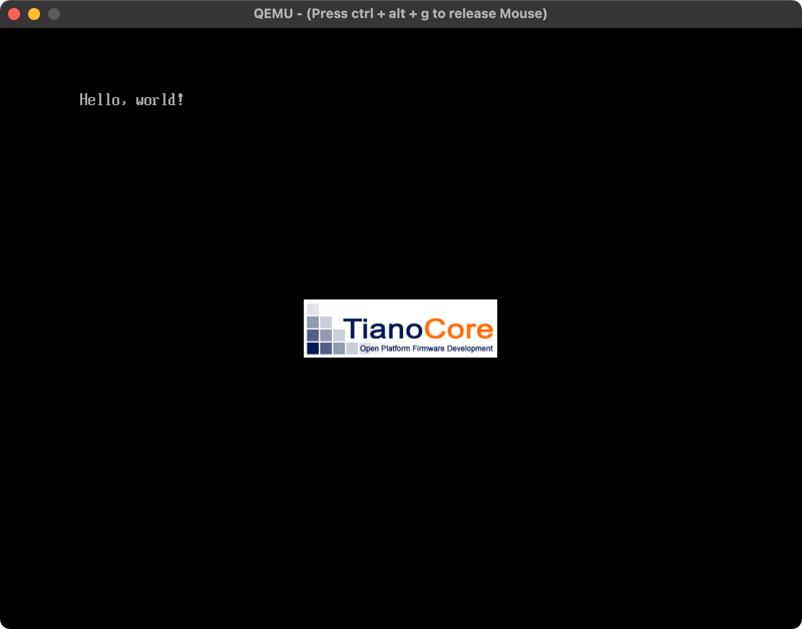

# Hello, World!

### QEMU のインストール

QEMU を brew でインストール。

```bash
❯ brew info qemu
qemu: stable 5.2.0 (bottled), HEAD
Emulator for x86 and PowerPC
https://www.qemu.org/
❯ brew install qemu
❯ qemu-img --version
qemu-img version 5.2.0
Copyright (c) 2003-2020 Fabrice Bellard and the QEMU Project developers
```

### dotfstools のインストール

Mac に mkfs.fat とかなかったので、インストール。 dotfstools を入れればいいらしい。

```bash
❯ brew install dosfstools
❯ mkfs.fat --help
mkfs.fat 4.2 (2021-01-31)
Usage: mkfs.fat [OPTIONS] TARGET [BLOCKS]
```

### Diskイメージの作成

fat形式のFSを作成する。

```bash
❯ qemu-img create -f raw disk.img 200M
Formatting 'disk.img', fmt=raw size=209715200
❯ mkfs.fat -n 'AOKI OS' -s 2 -f 2 -R 32 -F 32 disk.img
mkfs.fat 4.2 (2021-01-31)
```

- `-n VOLUME-NAME`
- `-s SECTORS-PER-CLUSTER`
    - Specify the number of disk sectors per cluster. Must be a power of 2, i.e. 1, 2, 4, 8, ... 128.
- `-f NUMBER-OF-FATS`
    - Specify the number of file allocation tables in the filesystem. The default is 2.
- `-R NUMBER-OF-RESERVED-SECTORS`
    - Select the minimal number of reserved sectors. With FAT32 format at least 2 reserved sectors are needed, the default is 32.
- `-F FAT-SIZE`
    - Specifies the type of file allocation tables used (12, 16 or 32 bit). If nothing is specified, mkfs.fat will automatically select between 12, 16 and 32 bit, whatever fits better for the filesystem size.

オプションは全部デフォルトっぽい。

```bash
❯ sudo mount -o loop disk.img mnt
mount: You must specify a filesystem type with -t.

❯ sudo mount -o loop -t fat disk.img mnt
mount: exec /Library/Filesystems/fat.fs/Contents/Resources/mount_fat for /Users/aoki/work/src/github.com/aoki/os/mnt: No such file or directory
mount: /Users/aoki/work/src/github.com/aoki/os/mnt failed with 72
```

`-o loop` はループバックデバイス機能を使ってイメージファイルをディスクとしてマウントするらしい。

- [【Linux】ディスクイメージをマウントする【ループバックデバイス】 - Man On a Mission](https://oplern.hatenablog.com/entry/2017/06/30/231027)

うまく動かなかったので調べたら、 `dhiutil` を使うらしい。

```bash
❯ hdiutil attach -mountpoint mnt disk.img
/dev/disk2          	                               	/Users/aoki/work/src/github.com/aoki/os/mnt
❯ mkdir -p mnt/EFI/BOOT
❯ ls -ld mnt/EFI/BOOT
drwxrwxrwx  1 aoki  staff  1024 Mar 28 00:51 mnt/EFI/BOOT
```

- [mac osx - Mount block file on OSX - Server Fault](https://serverfault.com/questions/174909/mount-block-file-on-osx)

### **BOOTX64.EFI**

バイナリエディタはVS Code で。

- [https://marketplace.visualstudio.com/items?itemName=ms-vscode.hexeditor](https://marketplace.visualstudio.com/items?itemName=ms-vscode.hexeditor)

**BOOTX64.EFI を入力**

EFI（Extensible Firmware Interface）の略らしい。

- [EFIとは｜「分かりそう」で「分からない」でも「分かった」気になれるIT用語辞典](https://wa3.i-3-i.info/word12797.html)

```bash
❯ sum BOOTX64.EFI
45132 2 BOOTX64.EFI
```

ち、ちがう〜。落ちついてこたウェをダウンロード。

- [https://raw.githubusercontent.com/uchan-nos/mikanos-build/master/day01/bin/hello.efi](https://raw.githubusercontent.com/uchan-nos/mikanos-build/master/day01/bin/hello.efi)

```bash
❯ curl -O https://raw.githubusercontent.com/uchan-nos/mikanos-build/master/day01/bin/hello.efi
❯ cmp -bl BOOTX64.EFI hello.efi
1031 144 d    154 l
1033  41 !    157 o
1035   0 ^@    54 ,
1037   0 ^@    40
1039   0 ^@   167 w
❯ diff <(hexyl --border none BOOTX64.EFI) <(hexyl --border none hello.efi)
30c30
<  00000400  48 00 65 00 6c 00 64 00   21 00 00 00 00 00 00 00  H0e0l0d0 !0000000
---
>  00000400  48 00 65 00 6c 00 6c 00   6f 00 2c 00 20 00 77 00  H0e0l0l0 o0,0 0w0
```

途中から次の行とおなじになってた。



直す。

```bash
❯ sum BOOTX64.EFI
12430 2 BOOTX64.EFI
❯ cp BOOTX64.EFI mnt/EFI/BOOT/BOOTX64.EFI
❯ ls -l mnt/EFI/BOOT/BOOTX64.EFI
-rwxrwxrwx@ 1 aoki  staff  1536 Mar 28 01:32 mnt/EFI/BOOT/BOOTX64.EFI
❯ umount mnt
```

### 起動

しない。

```bash
❯ qemu-system-x86_64 \
  -drive if=pflash,file=$HOME/osbook/devenv/OVMF_CODE.fd \
  -drive if=pflash,file=$HOME/osbook/devenv/OVMF_VARS.fd \
  -hda disk.img
qemu-system-x86_64: -drive if=pflash,file=/Users/aoki/osbook/devenv/OVMF_CODE.fd: Could not open '/Users/aoki/osbook/devenv/OVMF_CODE.fd': No such file or directory
```

いやぁ。それはそう。そんなところにそんなファイルおいた覚えはないからね。

ここにあるらしいのでDLする。

- [https://github.com/uchan-nos/mikanos-build/tree/master/devenv](https://github.com/uchan-nos/mikanos-build/tree/master/devenv)

```bash
❯ curl -O https://raw.githubusercontent.com/uchan-nos/mikanos-build/master/devenv/OVMF_CODE.fd
❯ curl -O https://raw.githubusercontent.com/uchan-nos/mikanos-build/master/devenv/OVMF_VARS.fd
❯ ls -l
total 11432
-rw-r--r--@ 1 aoki  staff       1536 Mar 28 01:30 BOOTX64.EFI
-rw-r--r--  1 aoki  staff    3653632 Mar 28 01:43 OVMF_CODE.fd
-rw-r--r--  1 aoki  staff     540672 Mar 28 01:43 OVMF_VARS.fd
-rw-r--r--  1 aoki  staff  209715200 Mar 28 01:32 disk.img
drwxr-xr-x  2 aoki  staff         64 Mar 28 00:31 mnt
❯ qemu-system-x86_64 \
  -drive if=pflash,file=OVMF_CODE.fd \
  -drive if=pflash,file=OVMF_VARS.fd \
  -hda disk.img
WARNING: Image format was not specified for 'OVMF_CODE.fd' and probing guessed raw.
         Automatically detecting the format is dangerous for raw images, write operations on block 0 will be restricted.
         Specify the 'raw' format explicitly to remove the restrictions.
WARNING: Image format was not specified for 'OVMF_VARS.fd' and probing guessed raw.
         Automatically detecting the format is dangerous for raw images, write operations on block 0 will be restricted.
         Specify the 'raw' format explicitly to remove the restrictions.
WARNING: Image format was not specified for 'disk.img' and probing guessed raw.
         Automatically detecting the format is dangerous for raw images, write operations on block 0 will be restricted.
         Specify the 'raw' format explicitly to remove the restrictions.
qemu-system-x86_64: Failed to lock byte 100
```

できない！とりあえず、warnを消す。

- [macos - How to resolve "Specify the 'raw' format explicitly to remove the restrictions." in qemu? - Stack Overflow](https://stackoverflow.com/questions/47235461/how-to-resolve-specify-the-raw-format-explicitly-to-remove-the-restrictions)

```bash
❯ qemu-system-x86_64 \
  -drive if=pflash,format=raw,file=OVMF_CODE.fd \
  -drive if=pflash,format=raw,file=OVMF_VARS.fd \
  -drive file=disk.img,format=raw,index=0,media=disk
qemu-system-x86_64: Failed to lock byte 100
```

うーん。できない！

いろいろいじって、マウントし直したらいけた。umount を使ってしまったのがいけなかったらしい。

```bash
❯ hdiutil attach -mountpoint mnt disk.img
❯ hdiutil detach mnt
```

Hello, world!


